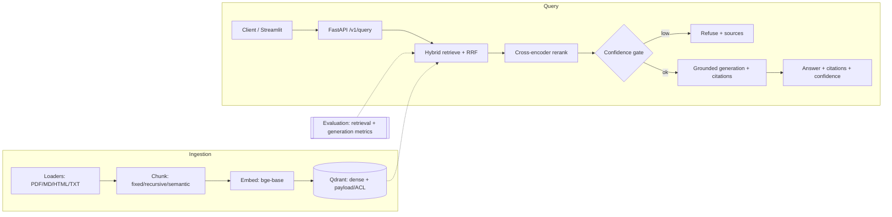

# RAG Engine — Production Hybrid RAG for Internal Knowledge Search

A production-grade Retrieval-Augmented Generation system for internal knowledge
search, built to demonstrate real AI engineering — not a notebook demo.

**Highlights**

- **Hybrid retrieval** — dense (bge embeddings) + sparse (BM25) fused with
  Reciprocal Rank Fusion, then a cross-encoder reranker for second-stage
  precision.
- **Citation verification** — every answer cites numbered sources; citations are
  parsed, validated against context, and scored (supported / unsupported /
  missing). Hallucinated citations are detected and dropped.
- **Evaluation framework** — golden dataset + retrieval metrics (Recall@K,
  Precision@K, MRR, nDCG, Hit Rate) and generation metrics (faithfulness,
  correctness, completeness, citation accuracy) via an LLM-as-judge with a
  deterministic lexical fallback. Every change is measurable.
- **Production engineering** — FastAPI with dependency injection and structured
  errors, structured logging + request tracing + a metrics endpoint,
  access-control filtering, a confidence gate that refuses on weak context, a
  Streamlit dashboard, and a one-command Docker stack.

## Architecture



More diagrams (ingestion / retrieval / end-to-end) and rationale:
[`docs/architecture.md`](docs/architecture.md).

## Tech stack

| Concern | Choice |
|---|---|
| API | FastAPI + Pydantic + Uvicorn |
| Vector store | Qdrant (dense + payload filtering) |
| Embeddings | `BAAI/bge-base-en-v1.5` (sentence-transformers) |
| Sparse | BM25 (`rank-bm25`) |
| Reranker | `BAAI/bge-reranker-base` cross-encoder |
| LLM | Ollama (default) · OpenAI · Anthropic (swappable) |
| Dashboard | Streamlit |
| Observability | structlog (JSON) + tracing abstraction + metrics endpoint |
| Eval | custom golden-set runner + LLM-as-judge |
| Deploy | Docker Compose (api · qdrant · ollama · frontend) |

## Setup (local, no Docker)

```bash
uv venv && uv pip install -e ".[dev,ingestion,eval]"
cp .env.example .env            # optional; defaults run locally with Ollama
uv run uvicorn api.app:app --reload --port 8000
```

## Run with Docker (full stack)

```bash
docker compose -f docker/docker-compose.yml up --build      # api + qdrant + ollama + frontend
docker exec -it rag-ollama ollama pull llama3.1:8b          # pull the model once
docker exec rag-api python -m scripts.bootstrap_demo        # seed demo data
```

Then open the dashboard at **http://localhost:8501** and the API docs (OpenAPI)
at **http://localhost:8000/docs**. See [`docs/deployment.md`](docs/deployment.md).

## Example API requests

```bash
# Ask a question (hybrid retrieval, engineering ACL)
curl -s http://localhost:8000/v1/query -H 'content-type: application/json' -d '{
  "query": "How do we deploy services?", "mode": "hybrid", "user": "engineering", "top_k": 5
}'

# Ingest documents
curl -s http://localhost:8000/v1/ingest -H 'content-type: application/json' -d '{
  "documents": [{"document_id": "runbook", "text": "Deploys use docker compose...", "acl": []}]
}'

curl -s http://localhost:8000/v1/documents      # list indexed documents
curl -s http://localhost:8000/v1/metrics        # request/latency metrics
curl -s http://localhost:8000/v1/health         # liveness
```

`/v1/query` returns:

```json
{
  "answer": "Deploys use docker compose [1].",
  "citations": ["runbook-0"],
  "confidence": 0.81,
  "sources": [{"document_id": "runbook", "score": 0.93}],
  "retrieved_chunks": [{"chunk_id": "runbook-0", "document_id": "runbook", "text": "...", "score": 0.93}],
  "latency_ms": 412.0
}
`
## Web frontend (React)

A professional React + Vite + Tailwind UI lives in [`web/`](web/). It provides a
query composer (mode, `top_k`, user/ACL), grounded answers with inline citations
and a confidence meter, a sources list, a collapsible retrieval inspector, and
live knowledge-base and metrics panels.

```bash
cd web
npm install
npm run dev        # http://localhost:5173  (expects the API on :8000)
```

Set `VITE_API_URL` to point at a non-local API. See [`web/README.md`](web/README.md).

## Deploy online

To publish a public version (Vercel frontend + Qdrant Cloud + hosted LLM + a
memory-capable API host), follow [`docs/deploy-online.md`](docs/deploy-online.md).
 routers, schemas, DI composition root, middleware
├── ingestion/   # loaders, chunkers, embedder, pipeline
├── retrieval/   # dense, sparse, hybrid (RRF), multi-query, cache, ACL
├── reranking/   # cross-encoder reranker
├── generation/  # LLM clients, grounded prompt, citations, confidence gate
├── evaluation/  # golden set, metrics, judges, runner, comparison, reports
├── storage/     # Qdrant vector store
├── services/    # answer orchestration, query rewriting, cache
├── frontend/    # Streamlit dashboard
├── docker/      # Dockerfiles + docker-compose
└── docs/        # architecture, deployment, evaluation
```

## License

MIT.
