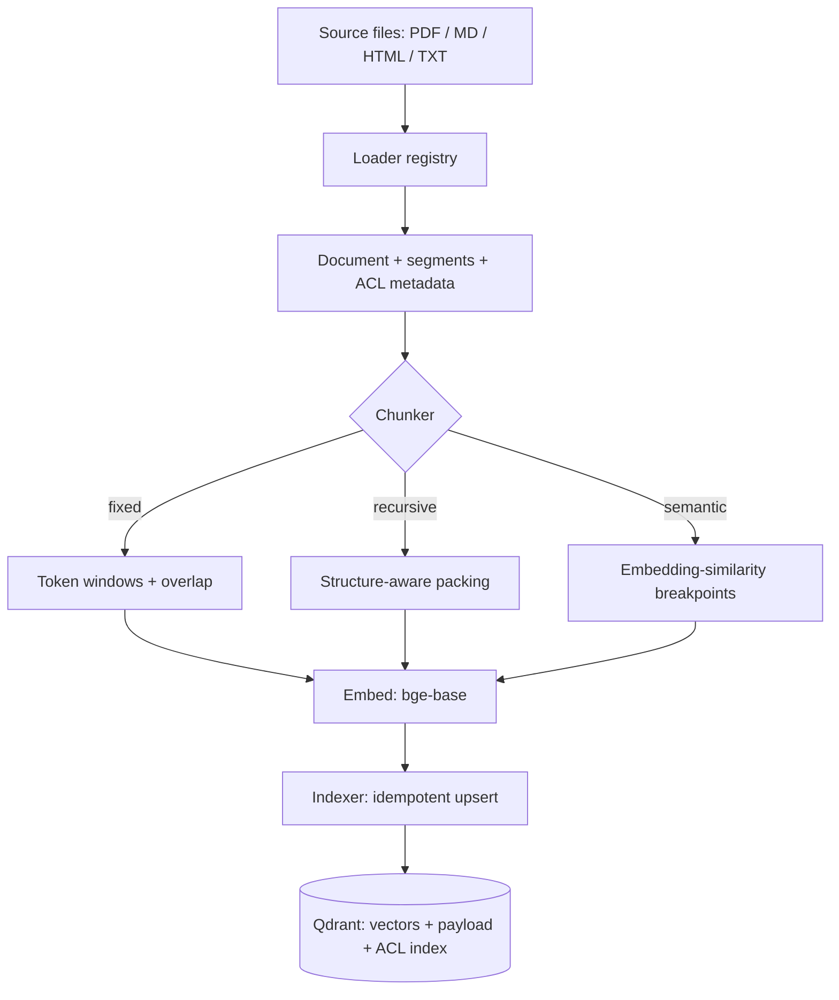
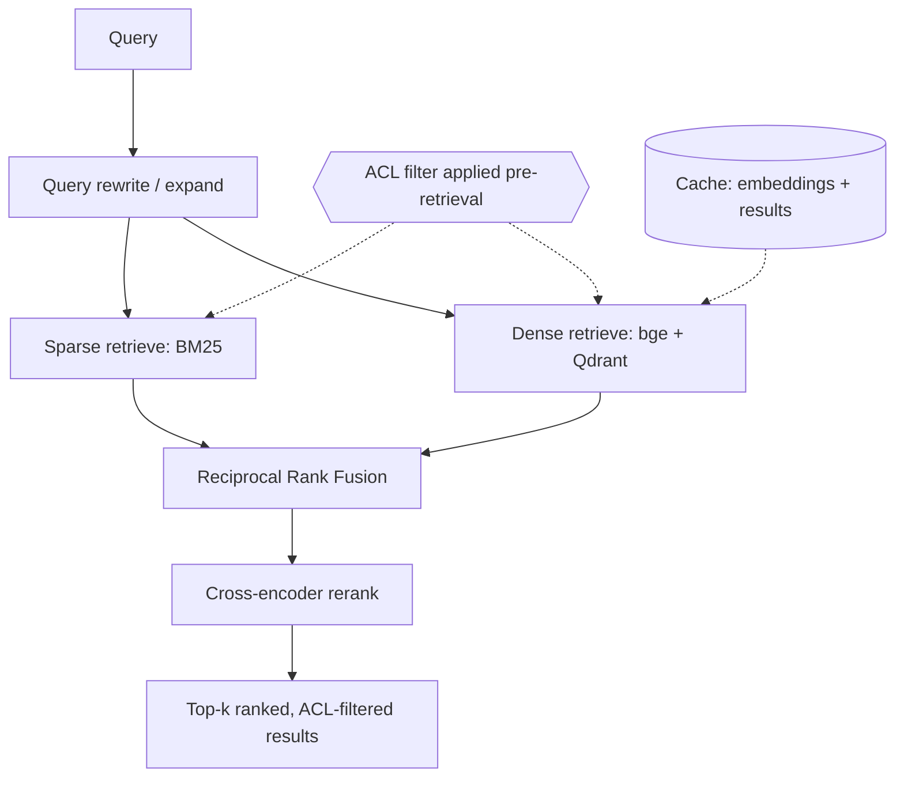
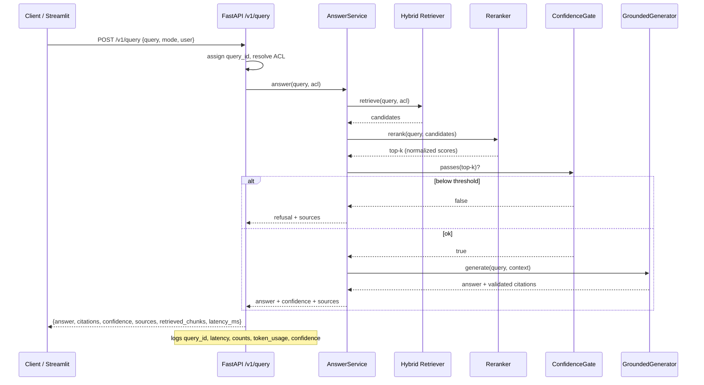

# Architecture Diagrams

## Ingestion pipeline

```mermaid
flowchart TB
    A[Source files: PDF / MD / HTML / TXT] --> B[Loader registry]
    B --> C[Document + segments + ACL metadata]
    C --> D{Chunker}
    D -->|fixed| E[Token windows + overlap]
    D -->|recursive| F[Structure-aware packing]
    D -->|semantic| G[Embedding-similarity breakpoints]
    E --> H[Embed: bge-base]
    F --> H
    G --> H
    H --> I[Indexer: idempotent upsert]
    I --> J[(Qdrant: vectors + payload + ACL index)]
```

## Retrieval pipeline

```mermaid
flowchart TB
    Q[Query] --> RW[Query rewrite / expand]
    RW --> D[Dense retrieve: bge + Qdrant]
    RW --> S[Sparse retrieve: BM25]
    D --> F[Reciprocal Rank Fusion]
    S --> F
    F --> RR[Cross-encoder rerank]
    RR --> OUT[Top-k ranked, ACL-filtered results]
    ACL{{ACL filter applied pre-retrieval}} -.-> D
    ACL -.-> S
    CACHE[(Cache: embeddings + results)] -.-> D
```

## End-to-end query flow

```mermaid
sequenceDiagram
    participant U as Client / Streamlit
    participant API as FastAPI /v1/query
    participant AS as AnswerService
    participant R as Hybrid Retriever
    participant RR as Reranker
    participant G as ConfidenceGate
    participant LLM as GroundedGenerator

    U->>API: POST /v1/query {query, mode, user}
    API->>API: assign query_id, resolve ACL
    API->>AS: answer(query, acl)
    AS->>R: retrieve(query, acl)
    R-->>AS: candidates
    AS->>RR: rerank(query, candidates)
    RR-->>AS: top-k (normalized scores)
    AS->>G: passes(top-k)?
    alt below threshold
        G-->>AS: false
        AS-->>API: refusal + sources
    else ok
        G-->>AS: true
        AS->>LLM: generate(query, context)
        LLM-->>AS: answer + validated citations
        AS-->>API: answer + confidence + sources
    end
    API-->>U: {answer, citations, confidence, sources, retrieved_chunks, latency_ms}
    Note over API: logs query_id, latency, counts, token_usage, confidence
```
