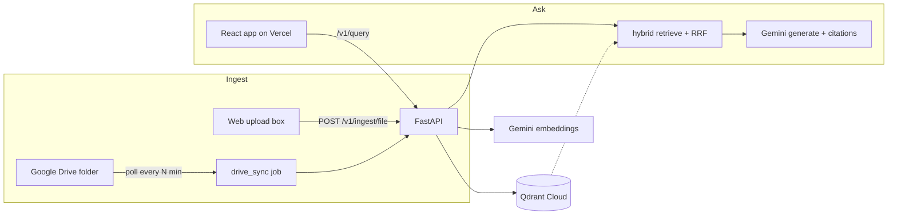

# v2 Plan — "Study Assistant": Gemini + Drive/Upload + Always-On

This is a design document only — no code is changed yet. It describes how to turn
the RAG Engine into a personal, always-online study assistant: drop schoolwork in
(via Google Drive **or** a web upload), then ask questions about it anytime.

## Goal

> Add my schoolwork → the system indexes it automatically → I ask questions and
> get grounded answers with citations, from any device, anytime.

## Why Gemini changes everything here

Today the API loads two PyTorch models at runtime (the `bge` embedder and the
cross-encoder reranker), needing ~2 GB RAM — too heavy for free always-on hosts.

Moving embeddings and generation to **Gemini's API** removes PyTorch from the
server entirely. The API becomes a light HTTP service that fits free tiers and
starts in seconds. This single decision is what makes "live anytime" affordable.

| Piece | Today | v2 |
|---|---|---|
| LLM | Ollama (local) | **Gemini** (`gemini-2.0-flash`) |
| Embeddings | `bge-base` (local, torch) | **Gemini** `text-embedding-004` (768-dim) |
| Reranker | cross-encoder (local, torch) | **optional** (off by default in cloud) |
| Server RAM | ~2 GB | ~256–512 MB |

`text-embedding-004` outputs 768 dimensions, which already matches your
configured `RAG_EMBEDDINGS__DIMENSION=768`, so the Qdrant collection size is
unchanged.

## Target architecture

Hosting (all free or near-free for personal use):
- **Frontend** → Vercel (free)
- **API** → Render / Railway / Fly free tier (light, no torch)
- **Vectors** → Qdrant Cloud (free 1 GB — plenty for notes)
- **LLM + embeddings** → Gemini API key (free tier, rate-limited)
- **Drive sync** → a free scheduled "cron job" service (or cron on a VM)

---

## Change set, file by file

### 1. Gemini LLM provider  (small)
- `configs/settings.py` — add `GEMINI = "gemini"` to `LLMProvider`; add
  `gemini_model: str = "gemini-2.0-flash"` to `LLMSettings` (reuse `api_key`).
- `generation/llm/factory.py` — add a `case LLMProvider.GEMINI` that returns the
  existing `OpenAIClient` pointed at Gemini's OpenAI-compatible endpoint
  (`https://generativelanguage.googleapis.com/v1beta/openai`) with `gemini_model`.
  `OpenAIClient` already supports a custom `base_url`, so **no new client needed**.
- `.env.example` — document `RAG_LLM__PROVIDER=gemini`, `RAG_LLM__GEMINI_MODEL`,
  `RAG_LLM__API_KEY`.

### 2. Gemini embeddings  (removes torch)
- `ingestion/embedding/gemini_embedder.py` (new) — implements the same embedder
  interface as `bge_embedder.py`, calling Gemini's `text-embedding-004` via HTTP
  (batched, normalized, 768-dim).
- `ingestion/embedding/factory.py` (new) — `build_embedder(settings)` returns the
  local or Gemini embedder based on config.
- `configs/settings.py` — `EmbeddingSettings` gains `provider: local|gemini` and
  reuses an API key.
- `api/services.py` and `scripts/ingest.py` — construct the embedder via the new
  factory instead of hard-coding `bge`.
- `pyproject.toml` — `sentence-transformers`/`torch` become an **optional**
  extra (`[local-models]`) so the default cloud install is lightweight.

### 3. Optional reranker
- `configs/settings.py` — `RerankerSettings.enabled: bool = True`.
- `reranking/identity.py` (new) — a pass-through reranker (keeps top-k as-is).
- `api/services.py` — pick the identity reranker when `enabled=false`, so cloud
  deploys load no cross-encoder. Quality drop is modest for personal notes;
  hybrid retrieval still ranks well.

### 4. Web upload (simple ingest)
- `api/routers/documents.py` — add `POST /v1/ingest/file` (multipart) that routes
  the file to your existing loader registry by extension (PDF/MD/HTML/TXT already
  supported), runs the ingestion pipeline, and upserts.
- `pyproject.toml` — add `python-multipart` (FastAPI file uploads).
- `web/src/components/KnowledgePanel.jsx` — add a drag-and-drop upload box that
  posts to the new endpoint and refreshes the document list.

### 5. Google Drive auto-sync
- `ingestion/sources/google_drive.py` (new) — list a folder via the Drive API,
  detect new/changed files (compare `modifiedTime`, or use the Changes API with a
  saved page token), download/export them (Google Docs → text; PDFs → bytes),
  and feed them to the pipeline.
- `scripts/drive_sync.py` (new) — one-shot entry point: "sync the folder now".
- Sync state — store last-seen tokens/timestamps in a small Qdrant collection or
  a JSON file, so each run only processes changes.
- Auth — a **Google service account**: download its JSON key, share your Drive
  study folder with the service account's email. The key is provided to the host
  as a secret env var (never committed).
- Scheduling — run `python -m scripts.drive_sync` on a schedule: a Render Cron
  Job (free) every ~10 min, or `cron` on a VM. (Truly-instant updates would need
  Drive push webhooks — a later enhancement.)

### 6. Security (important once it's public)
A public URL means anyone who finds it could query or ingest your notes. Add a
simple shared secret:
- `api/middleware.py` (or a dependency) — require a bearer token
  (`RAG_API_TOKEN`) on write/query endpoints; the frontend sends it. Minimal but
  effective for a personal app. Tighten CORS to your Vercel domain only.

### 7. Study-friendly extras (cheap wins, reuse existing code)
- **Subjects/tags** — your chunk model already carries `metadata` and the store
  already supports `metadata_filter`. Tag each document with a subject on ingest,
  then filter queries by subject ("ask only my Biology notes").
- Later ideas: generate flashcards/quizzes from a document, "explain like I'm 5",
  and per-subject summaries — all thin wrappers over the existing query path.

---

## Phased roadmap (recommended order)

1. **Phase 1 — Gemini core.** LLM + embeddings on Gemini, reranker optional.
   Outcome: the API runs torch-free and can be deployed always-on for free.
2. **Phase 2 — Deploy always-on.** Qdrant Cloud + API on a free host + frontend
   on Vercel, wired to your Gemini key.
3. **Phase 3 — Upload box.** `POST /v1/ingest/file` + the drag-and-drop UI, so you
   can add notes immediately with zero Google setup.
4. **Phase 4 — Drive auto-sync.** Service account + `drive_sync` + a cron schedule.
5. **Phase 5 — Polish.** API token auth, subject tagging/filtering, dedupe and
   deletion handling, study features.

Phases 1–3 already deliver the full experience (online, ask anytime, upload
notes). Phase 4 adds the "just drop it in Drive" convenience.

## Cost & limits (personal use)

- **Gemini** free tier: rate-limited but generous for one student's study Q&A.
- **Qdrant Cloud** free: 1 GB — thousands of pages of notes.
- **Vercel** free: the frontend.
- **API host** free: works; note that free tiers often **sleep when idle** (a
  slow first request after inactivity). A tiny keep-warm ping or a ~$5–7 plan
  keeps it instant if that bothers you.

## Open questions before building Phase 1

- Confirm Gemini model choice (`gemini-2.0-flash` is fast + cheap; `-pro` is
  stronger but slower/limited on free tier).
- Confirm you're OK using one Gemini key for both generation and embeddings.
- Pick the API host (Render is the simplest; Fly/Railway also fine).
